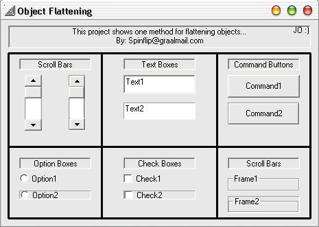



## FlatObjects

### Description

The Purpose of this code is to demonstrate how to semi flatten objects.
 
### More Info
 

             |
---                |---
**Submitted On**   |2002-04-09 20:10:18
**By**             |[Spinflip](https://github.com/Planet-Source-Code/PSCIndex/blob/master/ByAuthor/spinflip.md)
**Level**          |Intermediate
**User Rating**    |4.3 (13 globes from 3 users)
**Compatibility**  |VB 6\.0
**Category**       |[Custom Controls/ Forms/  Menus](https://github.com/Planet-Source-Code/PSCIndex/blob/master/ByCategory/custom-controls-forms-menus__1-4.md)
**World**          |[Visual Basic](https://github.com/Planet-Source-Code/PSCIndex/blob/master/ByWorld/visual-basic.md)
**Archive File**   |[FlatObject70560492002\.zip](https://github.com/Planet-Source-Code/spinflip-flatobjects__1-33647/archive/master.zip)

